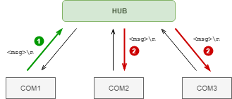

# Serial Port Hub

*Aplikace pro přeposílání zpráv mezi nekolika seriovými porty.*

Aplikace oetvře zadaný seznam seriových portů a přeposílá zprávy, které přijdou na libovolném z nich na všechny ostatní. Zpráva je libovolný text oddělený znakem `\n` (`\r` se ignoruje), tzn. co zpráva to řádek textu.

